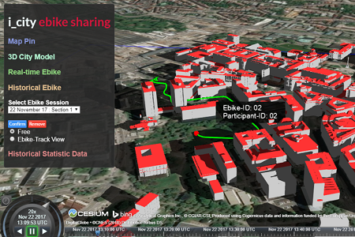
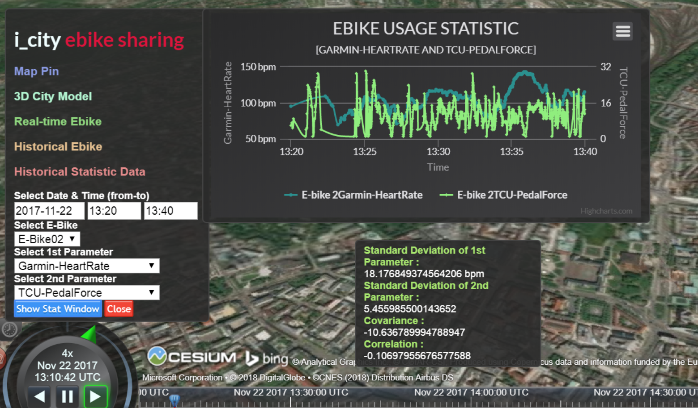
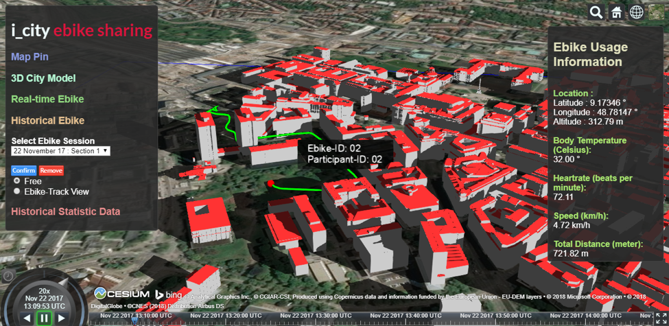
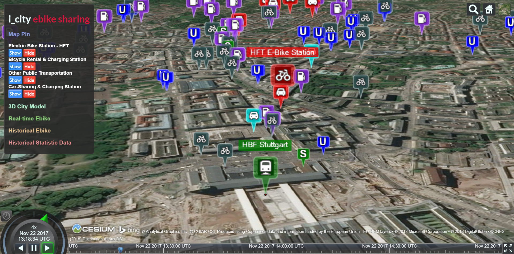
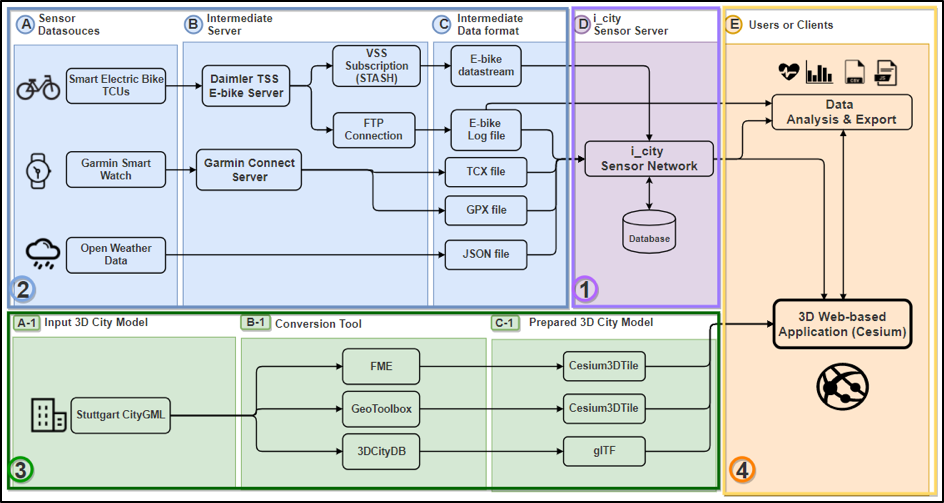

# Main Page
## Title: 
The i_city E-Bike sharing
## Description:
An application for simulating E-bike usages in the 3D city model by integration of heterogeneous sensor data.
## Img:

# Demo Page:
The “i_city E-Bike sharing” is a 3D web-based visual analytics application designed for researchers who are interested in the relation among the different parameters from sensor systems equipped on the E-bike sharing system in the Stuttgart city.

The main aim of this application is to show a simulation of the historical E-bike route track together with a comparison chart among the different selected parameters such as battery level, geospatial altitude, pedal force, motor support level, etc. The most important feature on Cesium to this application is a support of "Path" or 3D motion of an object over time. It is used to simulate the 3D path of the historical E-bike route which can be simply done by converting the sensor data to CZML format.

Also, another feature is the availability to visualize the 3D city model. Users can also activate the interested layers of 3D city model in the downtown area of the Stuttgart city and some points of interest such as bike station, bus station, etc. to understand the area better. 

This application is part of my master thesis work in a topic of "Visualization and Analysis of E-bike Usage in 3D City Model by Integration of Heterogeneous Sensor Data" [Master Thesis - Link](https://www.coors-online.de/en/lehre/abschlussarbeiten/master-arbeit-joe-thunyathep-santhanavanich/)

## Img:

## Contact
Thunyathep (Joe), Santhanavanich, M. Sc.
 * Email: thunyathep.s@outlook.com
 * LinkedIn : https://www.linkedin.com/in/thunyatheps/
